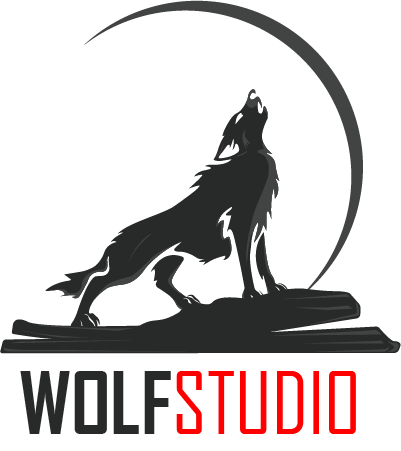

# **WOLF STUDIO** - The Industry Leading Studio

We are capable of creating surreal worlds and breathing life into fantasy and myths.

we have consistently been named one among the best VFX studios in India, providing creative services across the globe. Our administrative office in Los Angeles helps us to be available to our clients round the clock.

We work across films, commercials, VFX, and animation movies. Our robust pipeline assists directors with their passion projects and our enthusiastic and talented team of 200 artists works everyday to create the best work in the industry.

**WOLFSTUDIO** is now TPN compliant and certified, ensuring that any production walking through our doors can rest assured that their content is in reliable and secure hands.

TPN audit combines detailed security requirements for physical and digital infrastructure, to gain maximum content security.

## **Getting Started**

### **Prerequisites**

## **Authors**

1. Deepkumar Patel(0953510)

## **License**

This project is licensed under the **Fanshawe College**.

